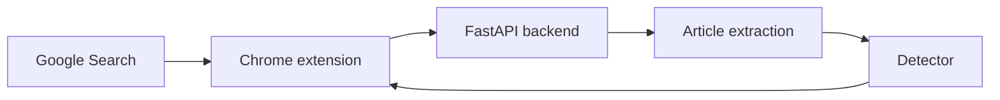

# AI Article Check

AI Article Check is an experimental Chrome extension that adds cautious
AI-authorship indicators to ordinary Google Search results. It fetches the
linked article through a small FastAPI backend, extracts the main text, and
runs an English AI-text classifier locally on the backend computer.

> [!IMPORTANT]
> This is an experimental signal. AI-text detectors can produce false positives
> and can often be defeated by editing or paraphrasing.

[Russian setup guide](README.ru.md)

## Features

- checks the first 6 results automatically on the first search page by default;
- fetches those pages concurrently and displays each result as soon as it is
  ready, without waiting for the slowest site;
- coalesces nearby article checks into bounded ONNX micro-batches without
  reducing the number of sites or text samples analyzed;
- uses only **Check for AI** buttons on page 2 and later search pages;
- adds a **Check for AI** button to later results for on-demand analysis;
- can analyze the rendered article in the currently open tab when direct
  backend downloading is blocked or the page requires JavaScript;
- displays compact color-coded badges next to the results;
- groups short tooltip reasons into evidence for and against AI authorship;
- opens a detailed evidence card with an explanation for every signal when a
  completed badge is clicked;
- identifies the strongest AI-like and human-like sampled passages, shows where
  they occur in the article, and includes short source excerpts;
- uses the pinned TMR ONNX detector selected through offline benchmark testing;
- uses separate probability curves and decision limits for pages yielding 1,
  2, or 3+ text samples;
- displays the resulting benchmark-calibrated **AI match** percentage while
  retaining the underlying sample counts on hover and click;
- keeps calibrated estimates continuous and bounded to **1–99%**, because a text
  classifier cannot prove authorship with absolute certainty;
- can issue a short-text result only when the stricter short-text calibration
  limit is crossed, rather than applying a long-article limit to every page;
- keeps the detailed evidence card independently scrollable;
- extracts article text rather than classifying the search snippet;
- uses a ready, quantized ONNX model locally with no per-request API fee;
- samples the beginning, middle, and end of long articles;
- detects explicit AI disclosures and leaked chatbot phrases;
- supports an optional external classifier;
- caches results in both the extension and the API;
- limits a slow page request to 8 seconds and lets the user retry it manually;
- distinguishes blocked, restricted, JavaScript-only, missing, rate-limited,
  non-HTML, and temporarily unavailable pages;
- recovers article text from JSON-LD when a page's visible HTML is only a shell;
- lets the user force a fresh download and analysis from every details card;
- records a compact content version so a fresh result can be identified;
- safely truncates oversized pages instead of rejecting them outright;
- blocks loopback, private, link-local, and reserved network targets;
- follows redirects only after validating every destination.

## How it works



The detector supports English articles in this version. Non-English pages get
an **English only** badge instead of a misleading score. The backend is local
during development. A public Chrome Web Store release uses a separate extension
build with a fixed HTTPS API origin and an exact CORS allowlist; users of that
build do not install Python or run a local server.

## Quick start

### Windows

The production archive includes the tested TMR calibration profile. It does not
require downloading benchmark datasets or scoring 1,600 validation texts.

1. Double-click `setup.cmd` once. It creates a Python 3.12 environment, installs
   runtime dependencies, validates the bundled calibration, and downloads the
   approximately 126 MB ONNX model.
2. Double-click `start.cmd` whenever you want to use the extension. Keep the
   window open while Chrome is running checks.
3. Verify <http://127.0.0.1:8787/health>. It must report version `0.9.7` and
   `"calibrated": true`.

The PowerShell scripts behind those launchers also detect a missing environment,
an invalid calibration file, a version conflict, and another process occupying
port 8787.

### Manual backend setup

Python 3.11 or newer is required.

With `uv`:

```bash
cd backend
uv venv
uv pip install -r requirements.txt
```

Download the model once (about 126 MB):

```powershell
.\.venv\Scripts\python.exe -m app.download_model
```

On macOS or Linux use `.venv/bin/python -m app.download_model` instead.

The files are cached on the computer and reused on later runs.

Run on Windows:

```powershell
.\.venv\Scripts\python.exe -m uvicorn app.main:app --host 127.0.0.1 --port 8787
```

Run on macOS or Linux:

```bash
.venv/bin/python -m uvicorn app.main:app --host 127.0.0.1 --port 8787
```

Verify the API at <http://127.0.0.1:8787/health>. The response must contain
`"calibrated": true`.

### Developer evaluation

The following commands are included only in the development archive or source
repository. They are never run when the extension or production server starts.
The released extension loads only the pinned TMR model. Install the additional
tooling first:

```bash
cd backend
uv pip install -r requirements-dev.txt
```

To reproduce the bundled calibration, build the MAGE validation subset and fit
the length-aware profile:

```powershell
.\.venv\Scripts\python.exe -m evaluation.build_validation_benchmark
.\.venv\Scripts\python.exe -m evaluation.calibrate_length_aware
```

On macOS or Linux, replace `.\.venv\Scripts\python.exe` with
`.venv/bin/python`. The first command downloads the official MAGE validation
CSV (about 72 MB) and selects 1,600 balanced natural texts. The second scores
them once, writes `backend/calibration.json`, and saves fit diagnostics in
`backend/evaluation/reports/length_calibration.json`. It fits independent
regularized curves and conservative decision limits for 1, 2, and 3+ samples.
Existing calibration is backed up as `calibration.previous.json`.

Run the independent realistic evaluation after calibration:

```powershell
.\.venv\Scripts\python.exe -m evaluation.build_web_benchmark
.\.venv\Scripts\python.exe -m evaluation.evaluate_web
```

The first command downloads the pinned MAGE test file (about 72 MB) and creates
an evaluation-only set of 800 natural texts: 400 human and 400 machine-written,
balanced across 8 domains. The second runs the current detector and writes
`backend/evaluation/reports/web_latest.json`. It does **not** change
`calibration.json`, its probability curve, or its decision limits. Raw model
scores are cached in `evaluation/data/web_scores.jsonl`, so recalculating the
report after a calibration change does not run all 800 model inferences again.
Use `evaluation.evaluate_web --rescore` only after changing the ONNX model.

An optional offline development command can compare deployable detector models:

```powershell
.\.venv\Scripts\python.exe -m evaluation.compare_models
```

The comparison does not rank candidates on the final test set. It creates a
deterministic, label/domain/length-stratified holdout inside MAGE validation,
fits every candidate on the remaining validation records, and selects a single
challenger on that holdout. Only that challenger and the current TMR baseline
are then refit on all 1,600 validation texts and evaluated on the separate 800
MAGE test texts. A challenger must improve balanced accuracy by at least three
percentage points while keeping false positives, AI precision, decided-case
accuracy, calibration error, and coverage inside explicit safety limits.

This developer-only command compares pinned revisions of TMR, GLYPH v1.1, and
Fakespot RoBERTa. It is not part of normal installation, startup, or article
analysis. TMR's existing score caches are reused when compatible. The two
challengers require about 743 MB of additional downloads and each validation
text is scored once; subsequent runs reuse candidate-specific caches. Results
are saved to `evaluation/reports/model_comparison_latest.json`. The command
deliberately does not change `app/config.py` or `calibration.json`; a model is
activated only after its report has been reviewed. The current production model
remains TMR.

### Chrome extension

1. Open `chrome://extensions`.
2. Enable **Developer mode**.
3. Select **Load unpacked**.
4. Select the `extension` directory.
5. Open Google Search and refresh the page.

The extension uses `http://127.0.0.1:8787` by default.

The popup contains only user actions: **Analyze this page** and the Google
auto-check limit. The limit is saved immediately when it is changed. Backend
health, versions, model state, and other infrastructure details are intentionally
omitted. If analysis infrastructure is unavailable, the user sees only a short
retry message after requesting an analysis.

Manual analysis is enabled only while the active tab is a normal HTTP or HTTPS
article page. It remains disabled on browser-internal pages, new tabs, and Google
Search itself.

After a successful manual analysis, **View details** expands an inline,
scrollable explanation without running the detector again. It shows sample
counts, analyzed words, evidence for AI, evidence against AI, and plain-language
explanations for each signal.

### Analyze an open article

If a Google result says **Access blocked**, **Needs JavaScript**, or **Not enough
text**, open that article normally in Chrome. Click the AI Article Check toolbar
icon and select **Analyze this page**. The extension extracts prose from the
page after its scripts have rendered, sends at most 80,000 cleaned characters to
the configured detector, and displays the result in the popup.

The result is cached under both the open URL and the page's canonical URL. When
you return to Google, the matching badge is updated from that cached result,
including on later search pages. This action never opens tabs automatically and
does not attempt to bypass a login or subscription. The `activeTab` permission
exists only so an explicit toolbar click can read the current page; the extension
does not receive permanent access to browsing history.

## Signals

| Signal | Meaning |
| --- | --- |
| Strong AI signal | Direct page evidence, or a calibrated score above the fitted limit for the available amount of text |
| Mixed signals | The calibrated score remains between the human and AI decision limits |
| No strong AI signal | The calibrated score remains below the benchmark-fitted human limit |
| English only | The extracted article is not supported by the current model |
| Unavailable | The page could not be downloaded or did not contain enough extractable text |

The extension never displays the model's raw softmax output as an authorship
probability. Schema 4 calibration selects the matching 1-, 2-, or 3+-sample
regularized Platt curve before displaying a percentage and making a decision.
Short pages therefore use stricter limits learned from short validation texts,
while long articles are not penalized by a universal minimum-sample rule.
Finite-sample targets and shrinkage keep each curve from collapsing to 0% or
100%. Weak style matches and page metadata remain context and cannot create a
categorical result.

Displayed estimates are bounded to 1–99% to avoid claiming proof that a
statistical text detector cannot provide. Decision limits are converted to the
same integer scale shown on the badge, preventing a visible 99% from remaining
below a hidden floating-point boundary. If no current calibration profile
exists, the extension falls back to the older sample-agreement percentage.

## Fresh checks and unavailable pages

Version 0.7.3 gives failed checks specific, short labels instead of treating
every failure as the same unavailable result. Temporary connection, timeout,
rate-limit, and server failures are retried once automatically. A details card
explains whether the site blocked automated access, requires JavaScript, hides
the article behind a login, returned a non-HTML file, or exposed too little
article text. JSON-LD `articleBody` data is used when it contains the article
but the visible HTML does not.

Block-page detection examines visible challenge text and dedicated challenge
pages, not arbitrary words inside a site's scripts. A normal article is not
rejected merely because site-wide JavaScript contains CAPTCHA, Cloudflare, or
access-denied configuration. HTTP 401/403 responses remain reported separately
because in that case the server genuinely refused the backend request.

The cleaned article still has an internal content fingerprint so cache entries
can be replaced safely, but that implementation detail is not displayed to the
user. **Recheck page** bypasses both the browser extension cache and the backend
cache, downloads the URL again, and replaces the saved result. This does not
continuously monitor pages; it provides an explicit fresh check when the user
suspects that an article changed.

## Length-aware calibration

`evaluation.build_validation_benchmark` deterministically selects 800 human
and 800 machine texts from the official MAGE **validation** split. It balances
8 domains and 27 generators, keeps texts at their natural lengths, and records
the pinned source revision and digest. This supplies hundreds of examples in
each runtime length band: 1 sample, 2 samples, and 3+ samples.

`evaluation.calibrate_length_aware` fits a separate smooth probability mapping
inside each band. Default AI limits target at most 1% human false positives for
one or two samples and 3% for three or more samples on validation data. Human
limits target at most 5% AI-to-human errors. These are fit-set constraints, not
final accuracy claims; only the separate MAGE test report measures transfer.

## Legacy HC3 benchmark

The optional legacy benchmark builder uses four English domains from the
[Human ChatGPT Comparison Corpus (HC3)](https://huggingface.co/datasets/Hello-SimpleAI/HC3):
Wikipedia/computer-science answers, open questions, finance, and medicine. It
combines paired answers into 200 human and 200 ChatGPT documents of 660 to
1,100 words. Every benchmark document therefore exercises at least three
detector samples, matching the runtime strong-AI rule. If a domain has fewer
eligible composed pairs, its
shortfall is deterministically redistributed across the other domains while
the total remains 400. Selection, deduplication, class balance, source
revision, license, split counts, and dataset digest are recorded automatically.

This command remains available for historical comparison. Version 0.7.1 uses
`calibrate_length_aware` for the active runtime profile; running the legacy
`evaluation.calibrate` command afterward would replace it with schema 3.

The default split is 75% calibration and 25% held-out testing. Thresholds target
a 5% false-positive rate and a 5% false-negative rate on the calibration split.
The generated report includes confusion counts, coverage, decided accuracy,
AI precision/recall, false-positive and false-negative rates, Brier score, log
loss, the displayed-probability distribution, and metrics for each held-out
domain. This makes model or sampling changes directly measurable instead of
relying on a few manually checked websites.

A legacy HC3 calibration candidate is rejected instead of activated when the held-out
test has zero AI recall, less than 25% decision coverage, excessive false
positives, fewer than three samples in any test document, less than 70%
accuracy among decided cases, or a probability scale that collapses back to a
few endpoint values. Rejected candidates are saved separately for debugging
and the API reports `"calibrated": false`.

## Independent web-like evaluation

The final accuracy check must use records that did not set any probability
curve or threshold. For that purpose,
`evaluation.build_web_benchmark` deterministically selects 800 untouched
records from the official MAGE test split. MAGE is independent of RAID, the
dataset used to train the default TMR model.

The selection contains 50 human and 50 AI texts from each of CMV, ELI5,
scientific generation, SQuAD, TLDR, WritingPrompts, XSum news, and Yelp reviews.
AI examples are balanced across 27 available generators and across continuation,
topical, and instruction-specified generation modes. Texts stay at their
natural lengths instead of being combined into artificial documents. This
directly measures all three length-specific calibration bands.

`web_latest.json` includes overall and balanced accuracy, decision coverage,
uncertain rate, AI recall, human recall, false-positive rate, Brier score, log
loss, segment counts, probability distributions, breakdowns by domain/model/
generation mode/length, and compact IDs for the strongest errors. This external
report is diagnostic only: no threshold or calibration parameter is selected
from it. That separation prevents the test from becoming another training set.

## Local model

The default classifier is the MIT-licensed
[TMR AI Text Detector](https://huggingface.co/Oxidane/tmr-ai-text-detector),
using the ready
[quantized ONNX conversion](https://huggingface.co/onnx-community/tmr-ai-text-detector-ONNX).
The backend runs it through ONNX Runtime on the CPU. Article text is not sent to
Hugging Face: that service is used only to download the model files.

For long articles, the backend spreads up to seven non-overlapping samples across
the cleaned article. With calibration enabled, their mean score is transformed
by the fitted curve for the available sample count and compared with that band's
conservative decision limits. Explicit AI
disclosures and obvious leaked chatbot phrases remain direct evidence. See
[THIRD_PARTY_NOTICES.md](THIRD_PARTY_NOTICES.md) for attribution.

Nearby article requests are coalesced for 40 milliseconds and scored in bounded
ONNX micro-batches. The default batch contains at most 14 text samples, matching
the former peak of two simultaneous seven-sample article runs while avoiding
duplicated tokenizer and inference overhead. Every article still keeps all of
its sampled text, and completed articles are released as soon as their own
scores are ready. `INFERENCE_BATCH_SIZE` can be raised on a larger hosting plan
without rebuilding the extension.

## Model comparison protocol

`evaluation.compare_models` exists to prevent replacement decisions from being
based on model-card claims or a few hand-picked pages. Candidate repositories,
ONNX filenames, label order, tokenizer mode, license, and exact Hugging Face
commit are recorded in `evaluation/model_candidates.py`.

The current default comparison contains only models that can run locally in
ONNX Runtime without a paid API. GLYPH uses its required slow SentencePiece
tokenizer. Fakespot uses an unmodified FP32 ONNX conversion, so its download and
memory footprint are substantially larger than TMR. Download size and scoring
time are recorded alongside quality metrics and cannot silently override the
quality gates. Candidate failures do not invalidate completed candidates, but
the mandatory TMR baseline must run successfully.

The 800-record MAGE test is not used to rank all candidates. Repeatedly choosing
the best model directly on that test would turn it into another tuning set and
make its reported accuracy optimistic. The validation holdout selects one
challenger first; the external test then decides whether that preselected model
actually replaces TMR.

## Large pages

Modern pages can contain several megabytes of scripts, styles, tracking data,
and embedded state. The API reads at most `MAX_DOWNLOAD_BYTES` bytes (5 MB by
default). When a response exceeds that limit, the downloaded prefix is still
parsed and analyzed. The result includes a truncation notice so users know that
only part of the page was examined.

Set a different development limit in `backend/.env`:

```env
MAX_DOWNLOAD_BYTES=8000000
```

The limit is still necessary to protect a public backend from unbounded memory,
bandwidth, and decompression usage.

## Optional external detector

Copy `backend/.env.example` to `backend/.env` and configure:

```env
EXTERNAL_DETECTOR_URL=https://detector.example.com/analyze
EXTERNAL_DETECTOR_API_KEY=secret
```

Expected request:

```json
{"text":"article text"}
```

Expected response:

```json
{"ai_probability":0.82,"confidence":0.74}
```

The external classifier acts as an additional independent vote; disagreement
cannot produce a strong AI result. Update your privacy policy before enabling a
third-party provider because publicly available article text will be sent to
that provider.

## API

### `POST /api/v1/analyze/batch`

```json
{
  "urls": [
    "https://example.com/article",
    "https://example.org/news"
  ],
  "force": false
}
```

Up to 10 URLs are accepted per request. Set `force` to `true` to bypass the
backend result cache.

### `GET /health`

Returns the API version, active detector mode, model state, and calibration
state. These diagnostics are for development and deployment checks; the public
extension does not expose infrastructure details to ordinary users.

### `POST /api/v1/analyze/text`

Accepts article text extracted from an explicitly opened browser tab, plus its
URL, optional canonical URL, title, author flag, and citation flag. It applies
the same language check, detector, calibration, and evidence rules as URL
analysis. Its result is cached only inside that user's extension, preventing
submitted browser text from replacing the service's shared URL result. Text is
limited to 80,000 characters and must contain at least 80 article words.

## Tests

```bash
cd backend
uv pip install -r requirements-dev.txt
pytest
```

JavaScript syntax checks:

```bash
node --check extension/background.js
node --check extension/content.js
node --check extension/popup.js
```

Create separate production and development archives:

```bash
python scripts/build_release.py
```

The local production ZIP contains only runtime files. The development ZIP
additionally contains benchmarks, model-comparison code, tests, and developer
dependencies. A separate backend deployment ZIP is also created.

After an HTTPS API has been deployed, build the Chrome Web Store ZIP with:

```bash
python scripts/build_release.py --public-api-base https://api.example.com
```

The store ZIP contains only the extension, fixes the API address at build time,
and requests access only to that API origin. See [DEPLOYMENT.md](DEPLOYMENT.md),
[PRIVACY.md](PRIVACY.md), and [STORE_LISTING.md](STORE_LISTING.md). Never submit
a package built with an example URL.

## Docker

```bash
docker compose build
docker compose run --rm api python -m app.download_model
docker compose up
```

The model cache is stored in a Docker volume. The API will be available at
<http://127.0.0.1:8787>.

## Current limitations

- some websites block automated requests; the extension now reports this
  separately, but cannot bypass the site's access policy;
- JSON-LD recovers some JavaScript-driven articles, but pages that expose no
  article text outside a real browser require the manual **Analyze current
  page** action;
- some reader canvases, closed shadow roots, PDF viewers, and subscription pages
  may still expose no usable article text even after being opened;
- only English articles are supported by the current model;
- Google can change its search-result markup at any time;
- AI-text classifiers can be wrong and edited text is harder to detect;
- mixed human-and-AI writing is particularly difficult to classify;
- the in-memory backend cache is not shared between server instances;
- the built-in request limiter is also per server instance, so a scaled public
  service needs a platform-level quota;
- the external MAGE benchmark is more diverse than HC3 but is still a static
  research corpus, not a live crawl of current websites;
- HC3's AI side comes from ChatGPT, so the report does not prove equal accuracy
  for every newer model or heavily edited AI text; use `web_latest.json` for the
  broader cross-generator result;
- a calibrated percentage is an empirical benchmark estimate, not proof of
  authorship.

## License

MIT
